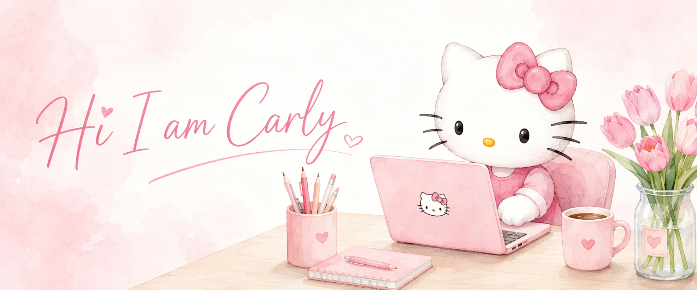
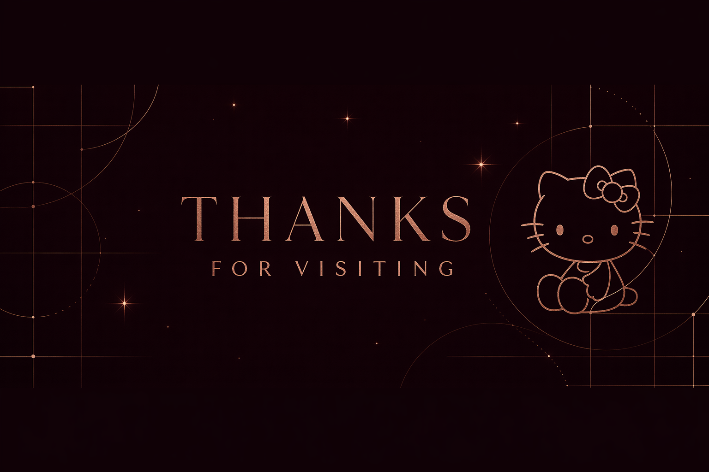

 

# 关于我

浙江大学本科在读，AI 产品经理，ENFJ。

关注 **Agent** 和 **C 端用户**。

在 AI 越来越强的时代，我想做那个一直在追问「用户到底感受到了什么」的人——保持对人的温度，做让人觉得「被理解」的产品。

 

# 项目

| | 项目 | 简介 |
|---|---|---|
| 🧮 | [**Mathos**](https://github.com/yakultyum/mathos) | AI 线性代数教学平台 — RAG 问答、自动批改、题库、3D 可视化 |
| 🪞 | [**Mirrora**](https://github.com/yakultyum/mirrora) | AI 驱动的个人舞蹈学习 app |
| 🪄 | [**Lumos**](https://github.com/yakultyum/lumos-app) | 以漂流瓶为灵感，面向中国青少年的自我成长记录 app |
| 🏛️ | [**希腊神话性格测试**](https://github.com/yakultyum/Greek-mythology-personality-test) | 希腊神话主题性格测试 |
| 🎩 | [**Sorting Hat**](https://github.com/yakultyum/sorting-hat) | 定制 AI 人设 + 工作流管理 skill |

 

# 产品理念

我想做那个离这些时刻最近的人——把人的复杂和混乱，翻译成团队可以真正落地的东西。让 AI 越来越强的同时，我们做出来的产品，依然是为人做的。

 

